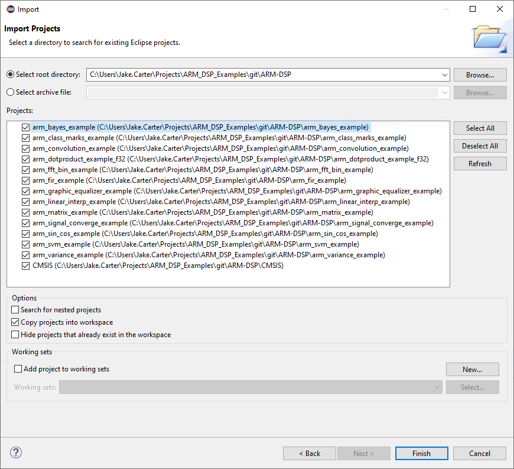

# ARM-DSP
Porting ARM's DSP examples to Maxim's LP microcontrollers.

# Introduction

  The projects in this repo are ports of ARM's DSP example projects that can be found in the [CMSIS-DSP library](https://www.keil.com/pack/doc/CMSIS/DSP/html/index.html) that have been made compatible with the build system in Maxim's Low-Power ARM Micro Toolchain.  Some slight modifications have been made to the source code to eliminate compiler errors/warnings, but the examples have been left mostly "as-is".  The major changes here have been made to the build system.

  Some of the example projects are dependant on a newer version of the CMSIS library than what is included in our toolchain, so pre-compiled binaries are included in this repo and the makefiles for the projects that need it are linked with a path relative to the project. So if the Bayes, FFT, or SVM projects are copied to a workspace outside of the repo, the CMSIS directory must be copied to into the same workspace.

Debug launch configurations are included in each project, and should appear in the "Favorites" menu in Eclipse.  These projects should be built from within our Eclipse environment as well.

# Required Components
- Maxim Low-Power ARM Micro Toolchain
  - Windows: https://www.maximintegrated.com/en/design/software-description.html/swpart=SFW0001500A
  - MAC: https://www.maximintegrated.com/en/design/software-description.html/swpart=SFW0001660A
- CMSIS 5.7.0 (Pre-compiled GCC libs are included in this repo)

# Software Download/Install

  Clone this repo to a desired location, and then use Eclipse to import the projects into the workspace by browsing to the root directory of the cloned repo.  If you decide to copy the projects into the workspace you'll need to copy the CMSIS folder into the workspace as well.  Otherwise, you can work on from within the repo directly by unchecking the "Copy projects into workspace" checkbox.

<b>Setup</b>

  The example projects come pre-configured for the MAX32660, but if you'd like to target a different microcontroller there are a few small modifications you'll need to make to the makefile within each project.

# Notes
- ** The filepath to the project directory must not contain spaces **

- All examples have been tested on the [MAX32660](https://www.maximintegrated.com/en/products/microcontrollers/MAX32660.html).
